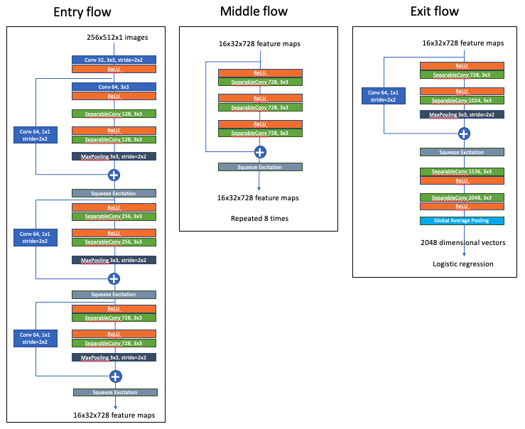

# Glaucoma Classification using General Fundus images

일반안저영상(General Fundus Image)를 사용하여 녹내장과 정상을 구분하는 학습 모델을 구현. Google에서 2016년도에 발표한 [Xception](https://arxiv.org/pdf/1610.02357.pdf)과 2017년 발표된 [Squeeze-and-Excitation Networks](https://arxiv.org/pdf/1709.01507.pdf)에서 제시하는 Squeeze Excitation Block을 혼합, 모델링.

## Data Preprocessing and Augmentation
녹내장을 진단할 수 있는 risk factor를 최대한 손상시키지 않으면서 그 특징들을 최대로 강화 진행.

### Augmentation
&nbsp; | 증강 종류 | 설명 
:----: | :-----: | :-:
1 | 영상 변환 및 증강 | 극좌표계변환 - 데카르트 x,y 좌표계를 극좌표계로 변환
2 | 영상 확대 여부 | 110%, 112%, 114%, 116%, 118%, 120% 만큼 영상을 확대하여 사용
3 | 영상 반전 여부 | 녹내장 데이터에 대해서만 실행
4 | 영상 회전 여부 | 영상 회전을 사용하지 않음

### Preprocessing
[전처리 함수 파일](./scripts/preprocess.py)에서 실제 구현 세부 내용을 확일 할 수 있음

&nbsp; | 증강 종류 | 설명 
:----: | :-----: | :-:
1 | 영상 변환 | Intensity Enhancement
2 | 영상 변환 | Intensity Normalization
3 | 영상 변환 | Median Filter
4 | 영상 변환 | Sharpening Filter
5 | 영상 변환 | Green Channel Extraction

## Model Architecture

Squeeze and Excitation Blcok (이하 SE)는 기존 네트워크를 거친 feature map들의 압축과 재조정을 통해 feature map의 스케일링을 수행해주는 Block. 이러한 SE Block들을 Xception 모델의 중간에 추가하여 사용. 기본적인 틀은 Xception을 따라가지만, Skip Connection의 덧셈 연산 후 Squeeze and Excitation Block이 들어간 것이 기존 Xception과 다른 모델 구조.

## Performance Estimation
10 fold crosss validation을 진행하였으며, 각 Fold에 대한 성능 지표로는 정확도(Accuracy), 민감도(Sensitivity), 특이도(Specificity), AUROC를 사용하여 학습하고 평가에 사용.
 
## Prerequisites
- **Python** ≥ `3.6.8`
- **Keras**     ≥            `2.2.4`
- **matplotlib**    ≥       `3.0.2`
- **numpy**           ≥      `1.16.0`
- **opencv-python**    ≥     `3.4.3.18`
- **pandas**        ≥        `0.23.4`
- **polarTransform**    ≥    `2.0.0`
- **scikit-learn** ≥         `0.20.2`
- **scipy**      ≥           `1.2.0`
- **sklearn**      ≥         `0.0`
- **tensorboard**   ≥        `1.12.2`
- **tensorflow**  ≥         `1.12.0`
- **tflearn**      ≥         `0.3.2`
- **tqdm**         ≥         `4.31.1`
